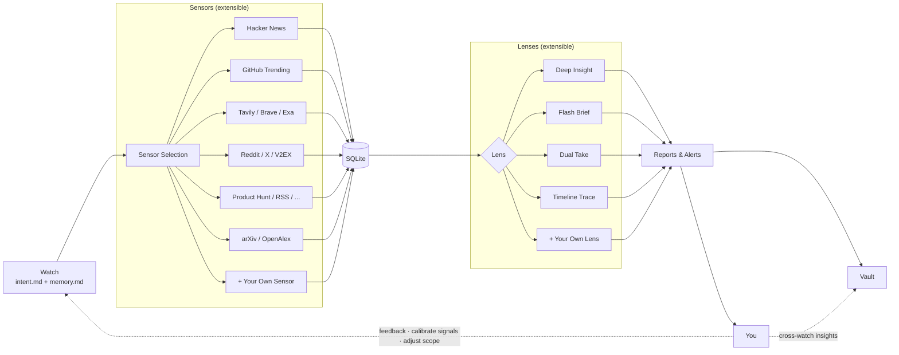

[中文](README.zh-CN.md) | English

<div align="center">

# Signex

**Signal + Nexus — where signals converge.**

An intent-driven personal intelligence agent that runs entirely inside [Claude Code](https://docs.anthropic.com/en/docs/claude-code).

[](LICENSE)
[](https://www.python.org/)
[](https://www.anthropic.com/)

</div>

---

## The Problem

You're tracking the AI coding tools space. Every day you check Hacker News, GitHub Trending, Reddit, X, Product Hunt… a dozen sources, an hour of scanning, mostly noise, and you still almost miss that one critical signal.

Signex does this for you. Describe what you care about in one sentence, and it automatically collects from 15+ data sources, deduplicates, analyzes, and delivers a report with actionable insights. You read the conclusions, give feedback, and it learns what matters to you.

## Who Is This For?

- Indie developers — tracking product opportunities, competitors, tech trends
- Startup founders — discovering unmet needs, validating product direction
- Tech leads — following industry direction, evaluating new tools and frameworks
- Product managers — monitoring user feedback, feature requests, market signals
- Investors / analysts — tracking market dynamics, spotting early signals
- Content creators — catching trending topics, sourcing writing material
- Researchers — continuously following developments in a specific domain

## What is Signex?

Signex is an intent-driven personal intelligence agent. You define what you care about (a "Watch"), and it autonomously collects data from multiple sources, analyzes it through different lenses, and delivers actionable reports. It remembers your feedback and adjusts future analysis accordingly.

Architecturally, **Claude Code IS the runtime.** There is no standalone app, server, or CLI wrapper. The agent's behavior is defined entirely in `CLAUDE.md`, and its capabilities are modular skills in `.claude/skills/`. You interact with it by talking to Claude Code.

## Core Concepts

| Concept | What it does |
|---------|-------------|
| **Watch** | A continuous monitoring intent. Defines what direction to watch and what signals matter. |
| **Sensor** | Data collection probes. Each sensor fetches from a specific source — Hacker News, GitHub, Reddit, search APIs, RSS, etc. |
| **Lens** | Analysis perspectives. Choose how to look at the data — deep insight, quick brief, pro/con evaluation, or timeline trace. |
| **Vault** | Cross-watch insight storage. Valuable findings that transcend individual watches get deposited here. |

## Architecture



## Quick Start

### Prerequisites

- [Python 3.11+](https://www.python.org/)
- [uv](https://docs.astral.sh/uv/) (Python package manager)
- [Claude Code](https://docs.anthropic.com/en/docs/claude-code) (the CLI)

### Setup

```bash
# Clone the repo
git clone https://github.com/your-username/signex.git
cd signex

# Install dependencies
uv sync

# Configure API keys (at minimum, set one search API key)
cp .env.example .env
# Edit .env with your API keys

# Start Claude Code in the project directory
claude
```

### First Run

```
You:  Hi
```

Signex initializes automatically on first greeting — creates your profile, watch templates, and vault. Then it gives you a situational briefing.

```
You:  Help me watch AI coding tools — new IDEs, agent features, community reactions.
```

Signex creates a new Watch with your intent, picks relevant sensors, and is ready to run.

```
You:  Run it.
```

Sensors fire, data flows into SQLite, the lens analyzes, and you get a report.

## Skills

### Sensors (data collection)

| Skill | Source | API Key | Get Key |
|-------|--------|:---:|---------|
| `fetch-hacker-news` | Hacker News front page & search | — | |
| `fetch-github-trending` | GitHub Trending repos | — | |
| `fetch-v2ex` | V2EX (Chinese tech community) | — | |
| `fetch-reddit` | Reddit posts & search | — | |
| `fetch-rss` | Any RSS/Atom feed | — | |
| `fetch-tavily` | Tavily web search | Yes | [tavily.com](https://app.tavily.com/sign-in) |
| `fetch-brave-search` | Brave Search | Yes | [brave.com](https://brave.com/search/api/) |
| `fetch-exa` | Exa AI semantic search | Yes | [exa.ai](https://dashboard.exa.ai/login) |
| `fetch-product-hunt` | Product Hunt launches | Yes | [producthunt.com](https://www.producthunt.com/v2/oauth/applications) |
| `fetch-request-hunt` | RequestHunt feature requests | Yes | [requesthunt.com](https://www.requesthunt.com) |
| `fetch-news-api` | NewsAPI.org | Yes | [newsapi.org](https://newsapi.org/register) |
| `fetch-gnews` | GNews | Yes | [gnews.io](https://gnews.io) |
| `fetch-x` | X / Twitter search | Yes | [developer.x.com](https://developer.x.com/en/portal/dashboard) |
| `fetch-arxiv` | arXiv preprints | — | |
| `fetch-openalex` | OpenAlex academic papers | Yes | [openalex.org](https://openalex.org/settings/api) |

### Lenses (analysis)

| Skill | Purpose |
|-------|---------|
| `lens-deep-insight` | Comprehensive analysis — key findings, trends, action items (default) |
| `lens-flash-brief` | 3–5 bullet quick summary |
| `lens-dual-take` | Pro/con evaluation of a topic |
| `lens-timeline-trace` | Event timeline reconstruction |

### Database

| Skill | Purpose |
|-------|---------|
| `db-save-items` | Store sensor data (auto-dedup) |
| `db-query-items` | Query items by watch, source, time |
| `db-save-analysis` | Record analysis runs |
| `db-stats` | Run history & statistics |
| `db-source-health` | Data source health monitoring |

### Actions & Orchestration

| Skill | Purpose |
|-------|---------|
| `run-watch` | Execute full watch cycle (collect → analyze → report) |
| `save-report` | Write reports and alerts to disk |
| `update-memory` | Integrate user feedback into watch memory |
| `extract-content` | Extract full article text from URLs |
| `skill-creator` | Guide for creating new skills |

## Project Structure

```
signex/
├── CLAUDE.md                  # Agent behavior definition (the brain)
├── .claude/skills/            # All skills (sensor, lens, db, action)
├── profile/identity.md        # User identity & preferences
├── watches/                   # Watch definitions
│   ├── index.md               # Watch registry
│   └── {watch-name}/
│       ├── intent.md          # What to monitor
│       ├── memory.md          # Accumulated feedback
│       └── state.json         # Run state
├── vault/                     # Cross-watch insights
│   ├── index.md               # Vault index
│   └── *.md                   # Individual insight notes
├── reports/{date}/{watch}/    # Analysis output
├── alerts/{date}/             # High-signal alerts
├── data/signex.db             # SQLite database
├── src/                       # Python scripts (HTTP + SQLite only)
└── .env                       # API keys (not committed)
```

## License

Copyright (c) 2026 Li Ze

This project is licensed under the [GNU Affero General Public License v3.0](LICENSE).

You are free to use, modify, and distribute this software under the terms of the AGPL-3.0. If you run a modified version as a network service, you must make the source code available to its users.
