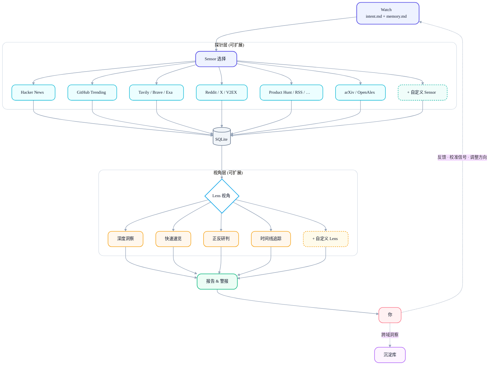

中文 | [English](README.md)

<div align="center">

# Signex

**Signal + Nexus — 信号汇聚之处。**

个人情报 Agent，完全运行在 [Claude Code](https://docs.anthropic.com/en/docs/claude-code) 之上。

[](LICENSE)
[](https://www.python.org/)
[](https://www.anthropic.com/)

</div>

---

## 它解决什么问题？

你关注 AI 编程工具赛道，每天要刷 Hacker News、GitHub Trending、Reddit、X、Product Hunt……十几个信息源，花一小时扫一遍，大部分是噪音，偶尔有一条关键信号差点漏掉。

Signex 替你干这件事。你用一句话描述关注方向，它自动从 15+ 数据源采集、去重、分析，给你一份带行动建议的报告。你只需要看结论、给反馈，它会越来越懂你要什么。

## 谁适合用？

- 独立开发者 — 盯产品机会、竞品动态、技术趋势
- 创业者 — 发现未被满足的需求、验证产品方向
- 技术负责人 — 跟踪行业方向、评估新工具和框架
- 产品经理 — 监控用户反馈、功能请求、市场信号
- 投资人 / 分析师 — 追踪赛道动态、发现早期信号
- 内容创作者 / 自媒体 — 捕捉热点话题、获取写作素材
- 研究者 — 持续跟踪特定领域的学术和产业进展

## Signex 是什么？

Signex 是你的 AI 情报分析师。你定义关注方向（Watch），它自主从多个数据源采集信息、用不同视角分析、生成可行动的报告。它会记住你的反馈，下次分析自动调整。

架构上，**Claude Code 就是运行时** — 没有独立的 app、server 或 CLI 包装。Agent 的行为完全由 `CLAUDE.md` 定义，能力以模块化 skill 的形式存放在 `.claude/skills/` 中。你直接和 Claude Code 对话来使用它。

## 核心概念

| 概念 | 作用 |
|------|------|
| **Watch** (监控哨) | 持续监控的意图方向。定义关注什么、什么信号重要。 |
| **Sensor** (探针) | 数据采集探针。每个 Sensor 对接一个数据源 — Hacker News、GitHub、Reddit、搜索 API、RSS 等。 |
| **Lens** (视角) | 分析视角。选择如何看待数据 — 深度洞察、快速速览、正反研判、时间线追踪。 |
| **Vault** (沉淀库) | 跨 Watch 的洞察存储。超越单个 Watch 的有价值发现沉淀于此。 |

## 架构



## 快速开始

### 前置条件

- [Python 3.11+](https://www.python.org/)
- [uv](https://docs.astral.sh/uv/)（Python 包管理器）
- [Claude Code](https://docs.anthropic.com/en/docs/claude-code)（CLI 工具）

### 安装

```bash
# 克隆仓库
git clone https://github.com/zhiyuzi/Signex.git
cd signex

# 安装依赖
uv sync

# 配置 API 密钥（至少配一个搜索类 API）
cp .env.example .env
# 编辑 .env 填入你的 API 密钥

# 在项目目录启动 Claude Code
claude
```

### 第一次使用

```
你：Hi
```

首次打招呼时 Signex 会自动初始化 — 创建用户画像、Watch 模板和沉淀库。然后给你一份态势简报。

```
你：帮我盯一下 AI 编程工具方向 — 新 IDE、agent 功能、社区反应。
```

Signex 根据你的意图创建 Watch，选择合适的 Sensor，准备就绪。

```
你：跑一下。
```

探针采集数据，存入 SQLite，视角分析，报告生成。

## Skills 清单

### Sensor（数据采集）

| Skill | 数据源 | 需要 API Key | 申请地址 |
|-------|--------|:---:|----------|
| `fetch-hacker-news` | Hacker News 首页 & 搜索 | — | |
| `fetch-github-trending` | GitHub Trending 仓库 | — | |
| `fetch-v2ex` | V2EX 中文技术社区 | — | |
| `fetch-reddit` | Reddit 帖子 & 搜索 | — | |
| `fetch-rss` | 任意 RSS/Atom 源 | — | |
| `fetch-tavily` | Tavily 网络搜索 | 是 | [tavily.com](https://app.tavily.com/sign-in) |
| `fetch-brave-search` | Brave Search | 是 | [brave.com](https://brave.com/search/api/) |
| `fetch-exa` | Exa AI 语义搜索 | 是 | [exa.ai](https://dashboard.exa.ai/login) |
| `fetch-product-hunt` | Product Hunt 新品发布 | 是 | [producthunt.com](https://www.producthunt.com/v2/oauth/applications) |
| `fetch-request-hunt` | RequestHunt 功能请求 | 是 | [requesthunt.com](https://www.requesthunt.com) |
| `fetch-news-api` | NewsAPI.org 新闻 | 是 | [newsapi.org](https://newsapi.org/register) |
| `fetch-gnews` | GNews 新闻 | 是 | [gnews.io](https://gnews.io) |
| `fetch-x` | X / Twitter 搜索 | 是 | [developer.x.com](https://developer.x.com/en/portal/dashboard) |
| `fetch-arxiv` | arXiv 预印本 | — | |
| `fetch-openalex` | OpenAlex 学术论文 | 是 | [openalex.org](https://openalex.org/settings/api) |

### Lens（分析视角）

| Skill | 用途 |
|-------|------|
| `lens-deep-insight` | 综合分析 — 关键发现、趋势、行动建议（默认） |
| `lens-flash-brief` | 3–5 条要点速览 |
| `lens-dual-take` | 正反论证研判 |
| `lens-timeline-trace` | 事件时间线梳理 |

### 数据库

| Skill | 用途 |
|-------|------|
| `db-save-items` | 存储采集数据（自动去重） |
| `db-query-items` | 按 Watch、来源、时间查询 |
| `db-save-analysis` | 记录分析运行 |
| `db-stats` | 运行历史统计 |
| `db-source-health` | 数据源健康监控 |

### 动作 & 编排

| Skill | 用途 |
|-------|------|
| `run-watch` | 执行完整 Watch 周期（采集 → 分析 → 报告） |
| `save-report` | 写入报告和警报 |
| `update-memory` | 将用户反馈整合到 Watch 记忆 |
| `extract-content` | 从 URL 提取文章全文 |
| `webhook-notify` | 报告生成后推送摘要到 IM 工具（飞书、Discord、企业微信等） |
| `webhook-setup` | 交互式 Webhook 配置向导 |
| `setup` | 项目初始化（目录、模板、数据库） |
| `skill-creator` | 创建新 Skill 的向导 |

## 项目结构

```
signex/
├── CLAUDE.md                  # Agent 行为定义（大脑）
├── .claude/skills/            # 所有 skill（sensor、lens、db、action）
├── profile/identity.md        # 用户画像
├── watches/                   # Watch 定义
│   ├── index.md               # Watch 索引
│   └── {watch-name}/
│       ├── intent.md          # 监控意图
│       ├── memory.md          # 反馈记忆
│       └── state.json         # 运行状态
├── vault/                     # 跨 Watch 洞察沉淀
│   ├── index.md               # 沉淀库索引
│   └── *.md                   # 独立洞察笔记
├── reports/{date}/{watch}/    # 分析报告
├── alerts/{date}/             # 高信号警报
├── knowledge/                 # Skill 知识库（参考文档）
├── data/signex.db             # SQLite 数据库
├── src/                       # Python 脚本（仅 HTTP 调用 + SQLite 操作）
└── .env                       # API 密钥（不提交）
```

## 许可证

Copyright (c) 2026 Li Ze

本项目采用 [GNU Affero 通用公共许可证 v3.0](LICENSE) 授权。

你可以自由使用、修改和分发本软件。如果你将修改版本作为网络服务运行，必须向用户提供源代码。
